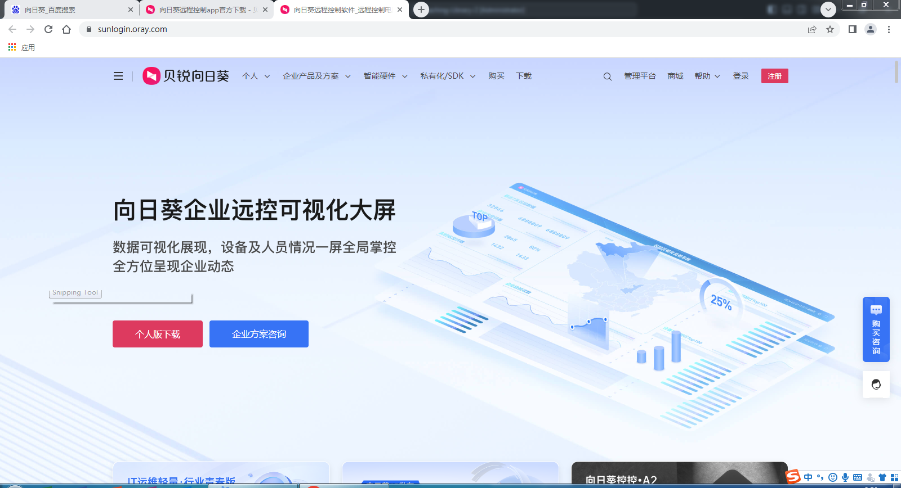
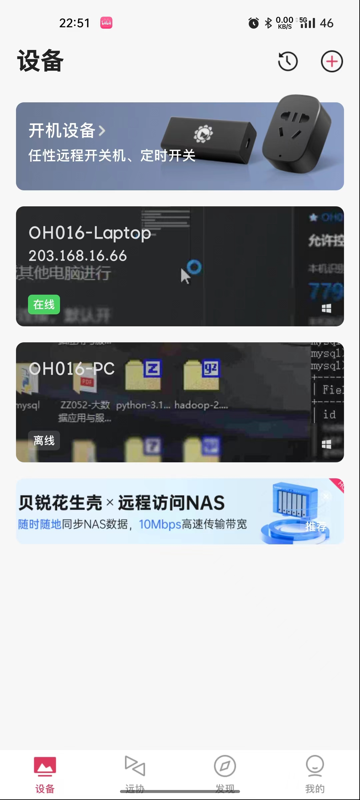
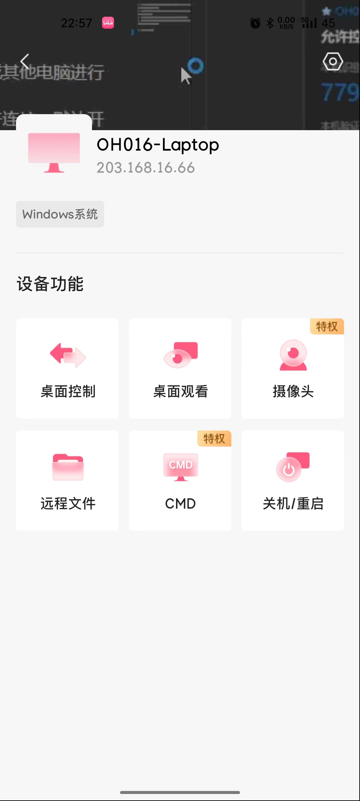

# 任务 1 掌握向日葵等网络管理软件的使用

## 了解远程软件

1. **向日葵**远程控制软件是一款拥有多年远控技术经验的远程控制软件，可远程控制手机，远程桌面连接，远程开机，远程管理等，并深入各行各业提供企业远程办公、企业IT运维、技术支持等企业远程解决方案。

     

    >- 双向远程文件传输
    >- 远程诊断与多样化远程控制
    >- 支持多摄像头、麦克风
    >- 统一的云配置平台
    >- 多种远程模式

2. **RustDesk**开源远程桌面访问解决方案：可以连接到远程计算机，提供远程支持和在线协作 

    

    >- 开源
    >- 开箱即用
    >- 无需任何配置
    >- 完全掌控数据
    >- 无需担心安全问题

3. **ToDesk**远程控制软件是一款稳定流畅的远程控制电脑手机连接软件,可远程桌面办公,远程协助运维.采用端对端加密,让每一次远程访问都安全可靠。

    

    >- 简洁易用与丰富功能
    >- 流畅稳定与低延迟
    >- 严密的安全机制
    >- 高效的协作与记录功能
    >- 高性能云端服务 ***云电脑***

4. **RDO**是一款功能强大内置的远程桌面管理软件，专为需要同时管理多个远程桌面的用户设计。

    

    >- Windows专业版内置
    >- 备份与恢复
    >- 会话管理
    >- 登录凭证储存
    >- 分类与组织

## 如何使用远程软件

- 以向日葵企业版为例

1. 在电脑打开向日葵企业版

>- 建议登录账号，在同一个账号下可以在手机或其他电脑直接连接
>- 未登录账号使用一下方法：
>- 本机识别码：每机器的唯一号码，使用手机或其他电脑进行连接时需要提供识别码
>- 本机验证码：连接设备时使用验证码才能允许连接，默认开启，为了安全性
>- 输入伙伴识别码：输入其他设备的识别码进行连接
>- 输入伙伴验证码：如果连接的设备需要验证码，填写验证码进行连接，一般都需要

3. 手机的向日葵

>- 只要电脑和手机都登录了同一个账号，设备列表就会显示设备

>- 桌面控制：手机端连接电脑操作
>- 桌面观看：手机端连接电脑但不操作
>- 远程文件：在手机端进行上传或下载电脑上的文件
>- 关机/重启：顾名思义，记得开电脑端的向日葵自启动，不然重启后要手动打开向日葵才能进行连接，电脑不在身边的话，就无法重新启动向日葵了