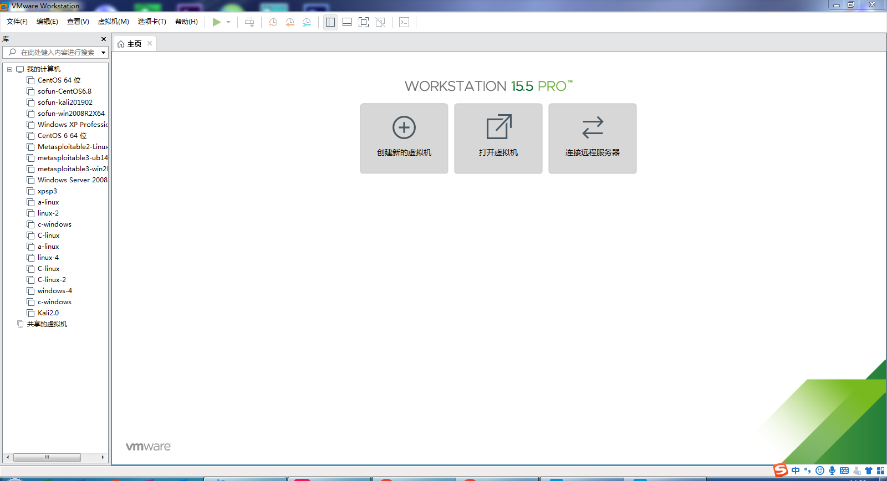
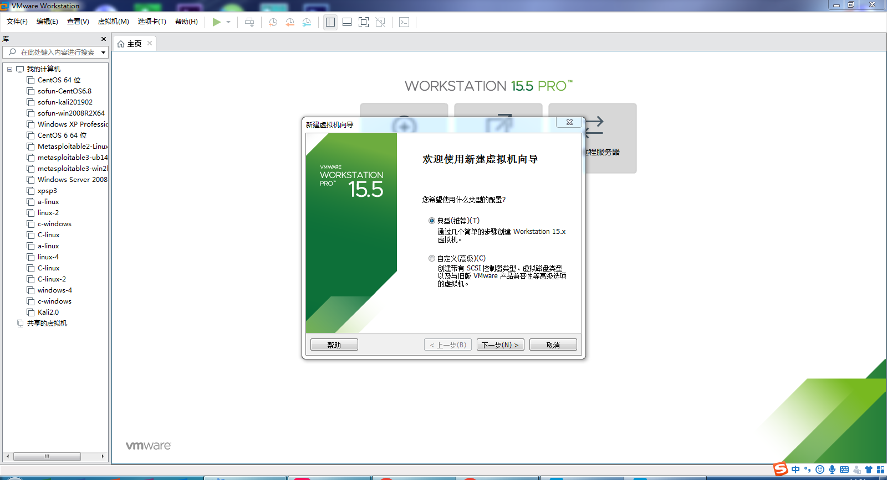
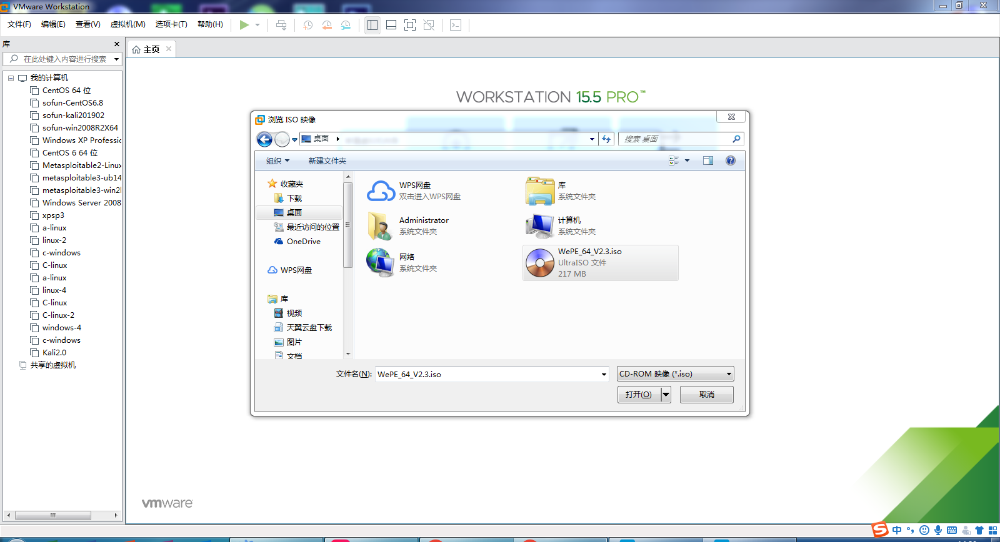
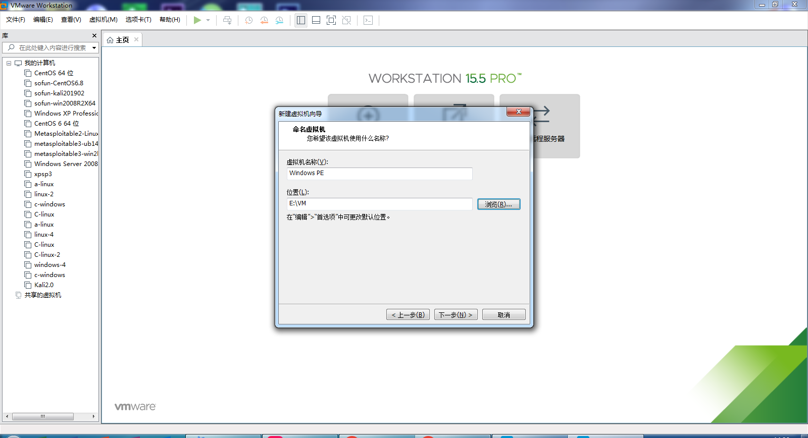
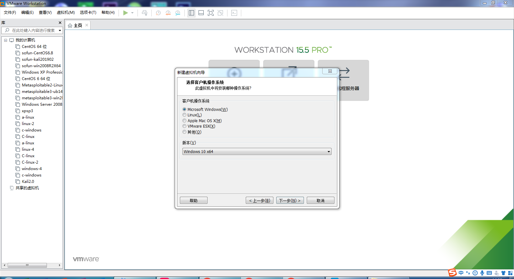
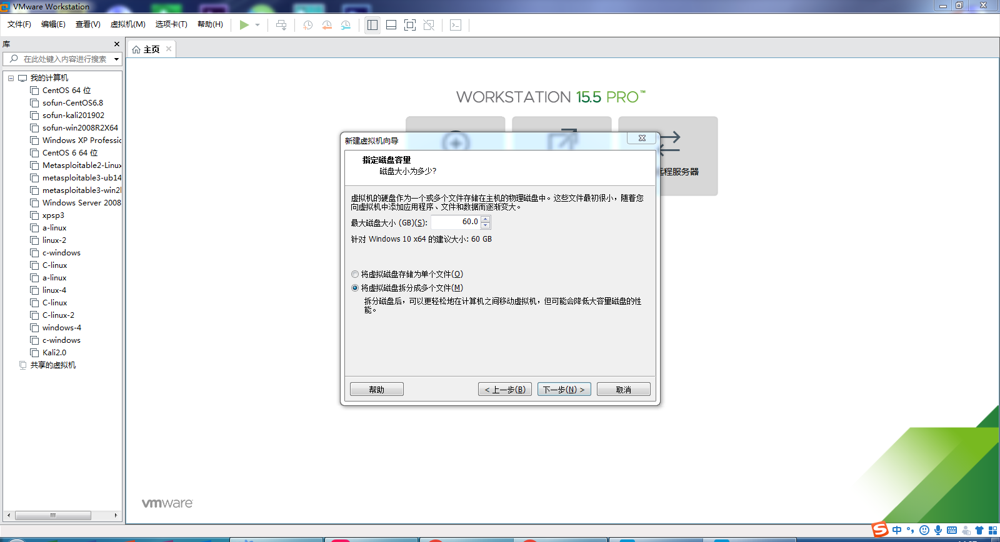

# 任务 2 掌握虚拟机的使用
## VMware 简介
- VMware是一款功能强大的桌面虚拟计算机软件.
- 其更好的灵活性与先进的技术胜过了市面上其他的虚拟计算机软件。对于企业的 IT开发人员和系统管理员而言， VMware在虚拟网路，实时快照，拖曳共享文件夹，支持 PXE 等方面的特点使它成为必不可少的工具. 

## VMware的使用
- 点击[官网链接](https://vmware.vmecum.com/)进行下载并配置。
1. 点击创建虚拟机

2. 可以选择典型of自定义，这里我们选择典型

3. 选择安装程序光盘映像文件（选择iso文件）

4. 选择后进行下一步

5. 根据iso文件来选择客户机操作系统

6. 自定义虚拟机名称和文件保存位置

7. 根据当前环境来指定磁盘容量（推荐最少20g）

8. 完成虚拟机的创建